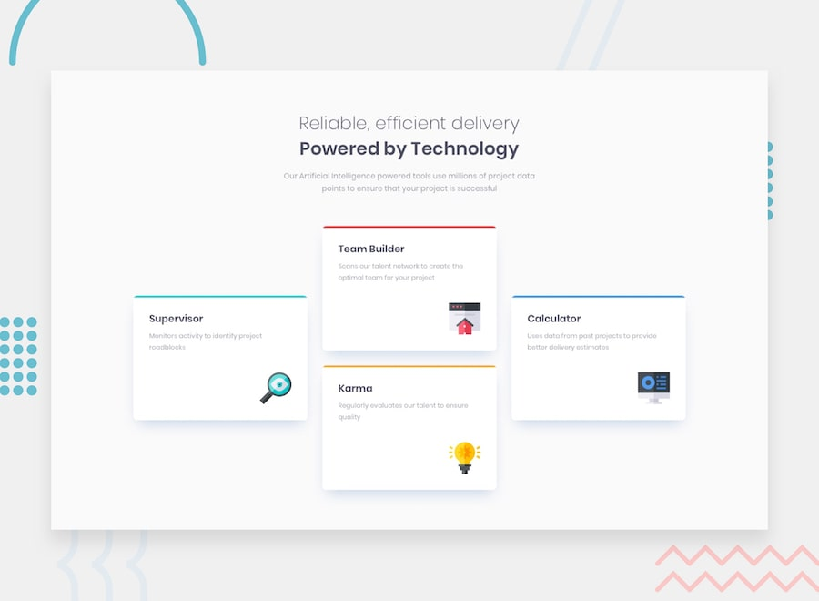

# Frontend Mentor - Four card feature section solution

This is a solution to the [Four card feature section challenge on Frontend Mentor](https://www.frontendmentor.io/challenges/four-card-feature-section-weK1eFYK). Frontend Mentor challenges help you improve your coding skills by building realistic projects. 

## Table of contents

- [Overview](#overview)
  - [The challenge](#the-challenge)
  - [Screenshot](#screenshot)
  - [Links](#links)
- [My process](#my-process)
  - [Built with](#built-with)
  - [What I learned](#what-i-learned)
  - [AI Collaboration](#ai-collaboration)
- [Author](#author)

## Overview

### The challenge

### Screenshot

### Links

- Solution URL: [Add solution URL here](https://your-solution-url.com)
- Live Site URL: [Add live site URL here](https://your-live-site-url.com)

## My process

### Built with

- Semantic HTML5 markup
- CSS custom properties
- Flexbox
- CSS Grid
- Mobile-first workflow

### What I learned
I LEARNED HOW TO USE CSS GRID AND FLEXBOX TO CREATE A RESPONSIVE LAYOUT. 

### AI Collaboration

Describe how you used AI tools (if any) during this project. This helps demonstrate your ability to work effectively with AI assistants.

- What tools did you use:  Claude, GitHub Copilot
- How did you use them guiding me on understanding the grid and flexbox properties and how to implement them in my project.

## Author

- Website - [Aisha Akin](https://www.your-site.com)
- Frontend Mentor - [@Aishaakin](https://www.frontendmentor.io/profile/Aishaakin)
- Twitter - [@DGilcore](https://www.x.com/DGilcore)
